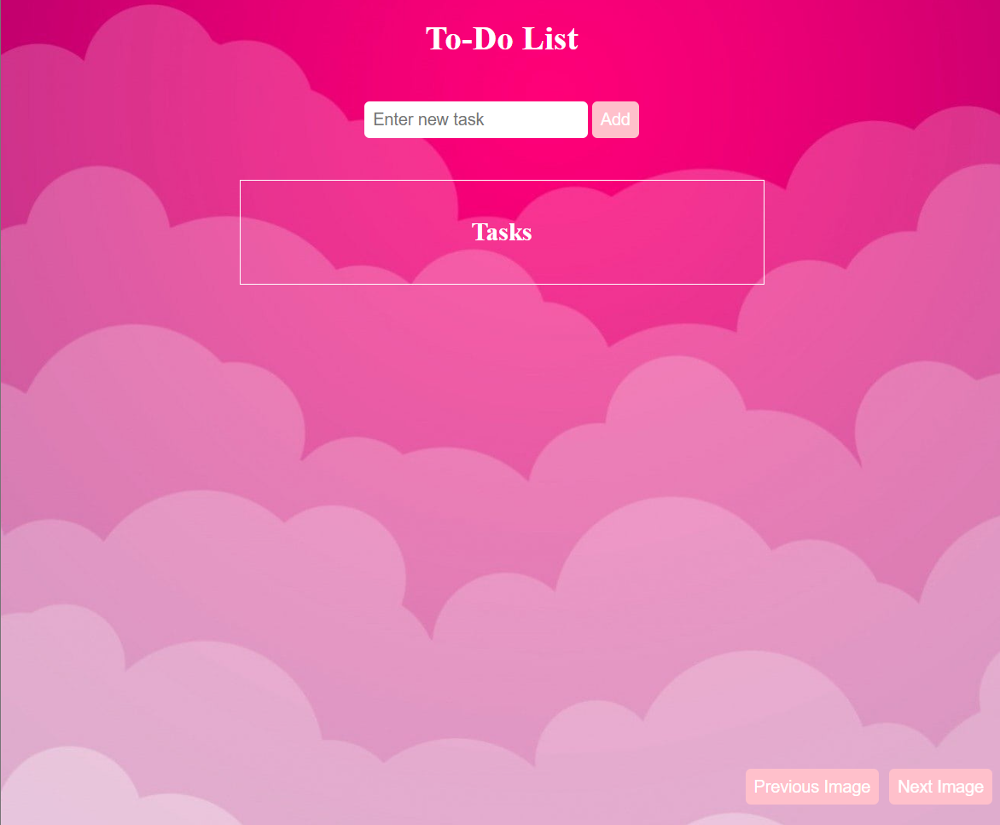
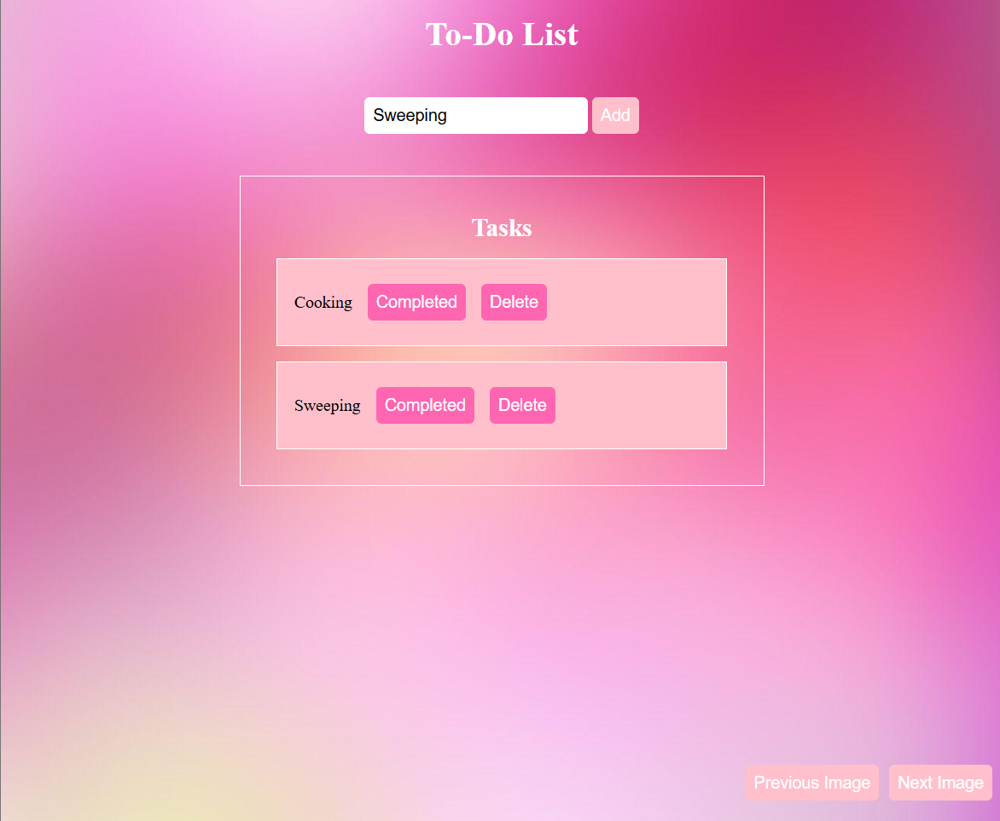
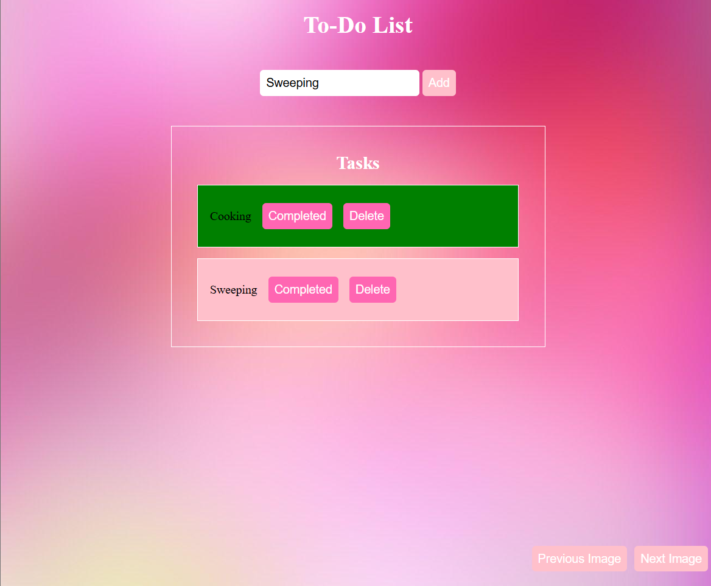

# My First JavaScript Project

## Image Gallery & To-Do List App

### 📸 Image Gallery Features:
- Next/Previous button navigation
- Cycles through 5 background images
- Smooth image transitions
- Full-screen display
-  *Changing gallery images*

### 📝 To-Do List Features:
- Add new tasks with form input  
   *Adding a new task*
- Mark tasks as completed (turns green)  
   *Marking task as done*
- Delete tasks permanently
- Simple pink/green visual feedback

### ✍🏻 What I Learned
- DOM manipulation
- Event listeners
- Dynamic element creation
- Basic state management
- Form handling

##  💻How to Use
1. Clone/download the project files
2. Open `index.html` in a browser
3. For the gallery: Click next/prev buttons
4. For the to-do list: Add tasks using the form

